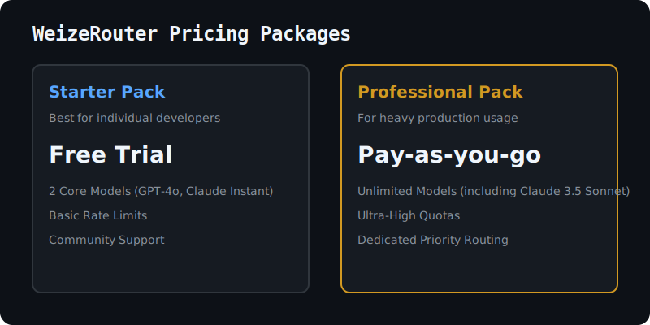
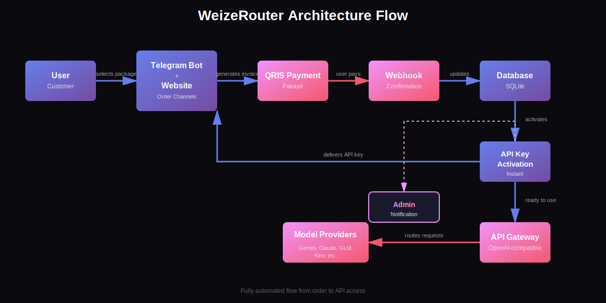
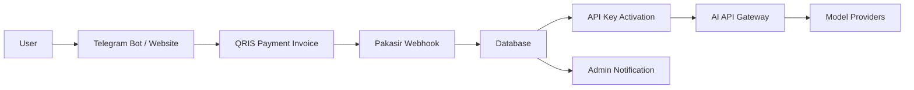
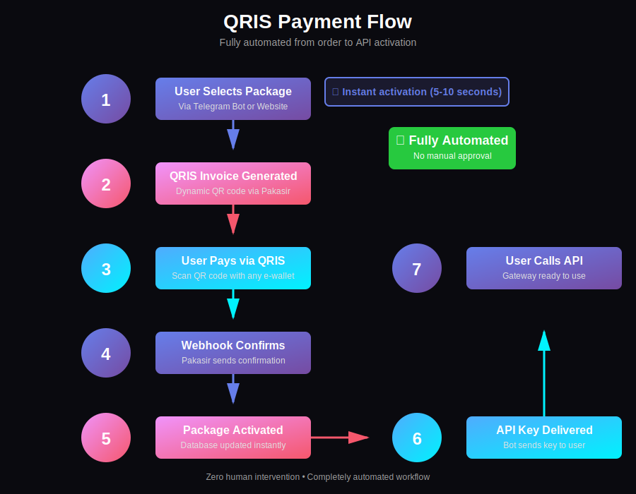
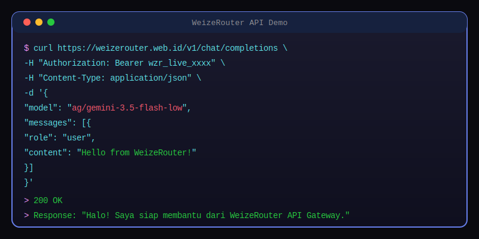

<!-- Badges -->
<div align="center">


</div>

---

<!-- Hero Banner -->
<div align="center">


# WeizeRouter

**AI API Gateway, Web Platform, Telegram Bot Ordering, and Automated QRIS Payment System**

*Multi-model AI access through automated QRIS payments, real-time API key activation, and OpenAI-compatible endpoints.*

</div>

---

## 🔗 Quick Links

| Platform | Link |
|----------|------|
| 🌐 **Website** | [https://weizerouter.web.id/](https://weizerouter.web.id/) |
| 💬 **Telegram Bot** | [https://t.me/WeizeRouterBot](https://t.me/WeizeRouterBot) |
| 📚 **Documentation** | [https://github.com/weizerouter/weizerouter/tree/main/docs](https://github.com/weizerouter/weizerouter/tree/main/docs) |
| 💼 **LinkedIn** | [https://www.linkedin.com/in/weize-wang-4262b7406](https://www.linkedin.com/in/weize-wang-4262b7406) |

---

## 🤖 What is WeizeRouter?

WeizeRouter is an **AI API Gateway and Web Platform** that provides multi-model AI access through automated QRIS payment, Telegram-based ordering, Google/GitHub login, real-time API key activation, and OpenAI-compatible API endpoints.

**Key Capabilities:**
- Multi-model AI API Gateway (Gemini, Claude, GLM, Kimi, and more)
- OpenAI-compatible API endpoint (`/v1/chat/completions`)
- Automated QRIS payment system via Pakasir
- Telegram Bot ordering channel
- Web Platform with dashboard and usage monitoring
- Instant API key activation via webhook automation
- Package-based model access control
- Fair Use monitoring with cooldown protection

WeizeRouter is built to make AI API access **simple, fast, and automated** for Indonesian developers.

---

## 🚀 Live Production Status

WeizeRouter is **already live** with:

- ✅ **Automated QRIS payment** — Dynamic invoice generation via Pakasir
- ✅ **Instant API key activation** — Real-time webhook confirmation
- ✅ **Active users** — Serving customers through Telegram Bot and Web Platform
- ✅ **Telegram bot ordering** — Full package ordering flow via @WeizeRouterBot
- ✅ **Web platform integration** — Dashboard, usage monitoring, and login via Google/GitHub
- ✅ **OpenAI-compatible API gateway** — Standard `/v1/chat/completions` endpoint
- ✅ **Package-based model access** — Mini Trial, Trial, Pro, Ultimate tiers
- ✅ **Fair Use cooldown protection** — Gateway stability management

---

## ⚡ Why WeizeRouter?

<table>
<tr>
<td width="50%">

### 🎯 Simple AI API Access
Drop-in OpenAI SDK compatibility. Just change the base URL and API key — no code changes needed.

</td>
<td width="50%">

### 💳 QRIS Payment Automation
Pay with any Indonesian e-wallet. Scan QR code, payment confirmed automatically, API key delivered instantly.

</td>
</tr>
<tr>
<td width="50%">

### ⚡ Instant API Key Activation
No manual approval. Webhook automation activates packages in 5-10 seconds after payment confirmation.

</td>
<td width="50%">

### 🌐 Multi-Model Gateway
Access multiple AI models through one unified API. Switch models by changing the `model` parameter.

</td>
</tr>
</table>

---

## 🎨 Features

- **AI API Gateway** — Multi-model AI access via unified endpoint
- **OpenAI-compatible API** — Drop-in replacement for OpenAI SDK
- **Telegram Bot ordering** — Full package ordering flow via bot
- **Web Platform** — Dashboard, usage monitoring, package management
- **Google/GitHub login** — Social authentication for web platform
- **Automated QRIS payment** — Dynamic invoice generation via Pakasir
- **Real-time package activation** — Webhook automation for instant activation
- **Usage monitoring** — Token usage tracking per API key
- **Fair Use cooldown protection** — Gateway stability management
- **Admin notification system** — Real-time transaction alerts
- **Package-based model access** — Tiered access control (Mini Trial, Trial, Pro, Ultimate)
- **PM2 production deployment** — Process management and auto-restart
- **Nginx reverse proxy** — Production-grade HTTP routing

---

## 📦 Package Overview



| Package | Price | Duration | Access | Description |
|---------|------:|----------|--------|-------------|
| **Mini Trial** | Rp 600 | 2 Hours | 1 Model | Quick API testing package |
| **Trial** | Rp 2.000 | 1 Day | 1 Model | Basic API access for learning |
| **Pro** | Rp 7.000 | 1 Day | 4 Models | Daily access for regular usage |
| **Ultimate** | Rp 15.000 | 1 Day | All Models | Unlimited Fair Use + All Models access |

**Note:** Model availability may change depending on gateway stability and provider availability.

---

## 🔌 API Usage

WeizeRouter provides an **OpenAI-compatible API endpoint**. Use it as a drop-in replacement for OpenAI API.

### Base URL

```txt
https://weizerouter.web.id/v1
```

### Example: cURL

```bash
curl https://weizerouter.web.id/v1/chat/completions \
  -H "Authorization: Bearer wzr_live_xxx_demo" \
  -H "Content-Type: application/json" \
  -d '{
    "model": "ag/gemini-3.5-flash-low",
    "messages": [
      {
        "role": "user",
        "content": "Hello from WeizeRouter"
      }
    ]
  }'
```

### Example: JavaScript (OpenAI SDK)

```javascript
import OpenAI from 'openai';

const client = new OpenAI({
  baseURL: 'https://weizerouter.web.id/v1',
  apiKey: 'wzr_live_xxx_demo'
});

const response = await client.chat.completions.create({
  model: 'ag/gemini-3.5-flash-low',
  messages: [
    { role: 'user', content: 'Hello from WeizeRouter' }
  ]
});

console.log(response.choices[0].message.content);
```

### Example: Python (OpenAI SDK)

```python
from openai import OpenAI

client = OpenAI(
  base_url="https://weizerouter.web.id/v1",
  api_key="wzr_live_xxx_demo"
)

response = client.chat.completions.create(
  model="ag/gemini-3.5-flash-low",
  messages=[
    {"role": "user", "content": "Hello from WeizeRouter"}
  ]
)

print(response.choices[0].message.content)
```

**Note:** Replace `wzr_live_xxx_demo` with your actual API key from Telegram Bot or Web Dashboard.

**Available Models:** `ag/gemini-3.5-flash-extra-low`, `ag/gemini-3.5-flash-low`, `ag/gemini-3-flash`, `ag/gemini-3-flash-agent`, `ag/gemini-pro-agent`, `ag/gemini-3.1-pro-low`, `weizerouter/glm-5`, `weizerouter/kimi-k2.7-code`, `ag/claude-sonnet-4-6`, `ag/claude-opus-4-6-thinking`, and more.

Full model list available at: [docs/api-usage.md](docs/api-usage.md)

---

## 🏗️ Architecture





**Components:**
- **User** — Customer ordering via Telegram Bot or Website
- **Telegram Bot / Website** — Order channels (dual-channel support)
- **QRIS Payment** — Dynamic invoice generation via Pakasir
- **Webhook** — Real-time payment confirmation
- **Database** — SQLite storage for users, packages, API keys
- **API Key Activation** — Instant activation upon payment confirmation
- **API Gateway** — OpenAI-compatible proxy to model providers
- **Model Providers** — Gemini, Claude, GLM, Kimi, etc.
- **Admin Notification** — Real-time transaction alerts via Telegram

Full architecture details: [docs/architecture.md](docs/architecture.md)

---

## 💰 Payment Flow



**7-Step Automated Flow:**

1. **User selects package** — Via Telegram Bot or Website
2. **QRIS invoice is generated** — Dynamic QR code via Pakasir API
3. **User pays using QRIS** — Scan with any Indonesian e-wallet (GoPay, OVO, DANA, ShopeePay, etc.)
4. **Webhook confirms payment** — Pakasir sends confirmation to WeizeRouter webhook endpoint
5. **Package is activated automatically** — Database updated, expiry time set
6. **API key is delivered instantly** — Bot sends API key to user (5-10 seconds total)
7. **User can call the API endpoint** — Gateway is ready to use immediately

**No manual approval. No payment proof submission. Fully automated.**

Full payment flow details: [docs/payment-flow.md](docs/payment-flow.md)

---

## 💻 Terminal Demo



Try WeizeRouter API directly from your terminal:

```bash
curl https://weizerouter.web.id/v1/chat/completions \
  -H "Authorization: Bearer YOUR_API_KEY" \
  -H "Content-Type: application/json" \
  -d '{
    "model": "ag/gemini-3.5-flash-low",
    "messages": [{"role": "user", "content": "Hello!"}]
  }'
```

---

## 📸 Preview

### Website Homepage
Professional SaaS landing page with package pricing, feature showcase, and integration examples.

### Telegram Bot Ordering
Full package ordering flow: package selection → QRIS invoice → payment → instant API key delivery.

### Dashboard Usage Monitoring
Real-time token usage tracking, API key management, and package expiry monitoring.

### QRIS Payment Flow
Dynamic QR code generation, automatic payment confirmation, and instant activation.

**Note:** Screenshots are not included in this public repository to protect user privacy and API key security.

---

## 🛡️ Fair Use Protection

WeizeRouter uses **Unlimited Fair Use with Cooldown Protection** to keep the gateway stable for all users.

**How it works:**
- Ultimate package provides unlimited fair use access
- Cooldown protection prevents gateway overload
- Ensures stable service for all active users
- Automatic recovery after cooldown period

Fair use policy details: [docs/fair-use.md](docs/fair-use.md)

---

## 🛠️ Tech Stack

**Backend:**
- Node.js + Express.js
- SQLite database
- PM2 process management
- Nginx reverse proxy

**Integration:**
- Telegram Bot API
- Pakasir QRIS payment gateway
- OpenAI-compatible API gateway architecture
- Webhook automation system

**Authentication:**
- Google OAuth 2.0
- GitHub OAuth
- Session-based authentication

**Deployment:**
- VPS (Ubuntu Server)
- HTTPS via Let's Encrypt
- Domain: weizerouter.web.id

---

## 🗺️ Roadmap

**Current Focus:**
- ✅ Website checkout system
- ✅ Token usage dashboard
- ✅ Admin monitoring dashboard
- ✅ Package-based access control

**Coming Soon:**
- 🔄 API status page
- 🔄 More model providers
- 🔄 Enhanced documentation
- 🔄 Developer SDK examples
- 🔄 Python/JavaScript client libraries
- 🔄 Usage analytics and insights
- 🔄 Webhook callback support
- 🔄 API rate limit customization

Full roadmap: [ROADMAP.md](ROADMAP.md)

---

## 👤 Founder & Creator

**Created by Wang Weize**

Wang Weize is building WeizeRouter as an AI API Gateway, Web Platform, Telegram Bot Ordering system, and QRIS Automation platform to make AI API access simple, fast, and automated for Indonesian developers.

**Connect:**
- LinkedIn: [https://www.linkedin.com/in/weize-wang-4262b7406](https://www.linkedin.com/in/weize-wang-4262b7406)
- Telegram: [@WeizeRouterBot](https://t.me/WeizeRouterBot)
- Website: [https://weizerouter.web.id/](https://weizerouter.web.id/)

---

## 🔐 Security Notice

**This public repository is for documentation and branding only.**

It does **NOT** include:
- Production source code
- Real API keys
- Telegram bot tokens
- Payment provider secrets (Pakasir API keys)
- Database files
- Private server credentials
- SSH keys or server access
- User data or transaction records

**Production infrastructure is private and secured separately.**

---

## 🤝 Contributing

WeizeRouter is currently a **private production system**. This repository serves as public documentation and branding.

If you have suggestions, questions, or feedback:
- Open an issue in this repository
- Contact via Telegram Bot: [@WeizeRouterBot](https://t.me/WeizeRouterBot)
- Reach out on LinkedIn: [Wang Weize](https://www.linkedin.com/in/weize-wang-4262b7406)

---

## 📄 License

MIT License

Copyright (c) 2026 Wang Weize

Permission is hereby granted, free of charge, to any person obtaining a copy of this software and associated documentation files (the "Software"), to deal in the Software without restriction, including without limitation the rights to use, copy, modify, merge, publish, distribute, sublicense, and/or sell copies of the Software, and to permit persons to whom the Software is furnished to do so, subject to the following conditions:

The above copyright notice and this permission notice shall be included in all copies or substantial portions of the Software.

THE SOFTWARE IS PROVIDED "AS IS", WITHOUT WARRANTY OF ANY KIND, EXPRESS OR IMPLIED, INCLUDING BUT NOT LIMITED TO THE WARRANTIES OF MERCHANTABILITY, FITNESS FOR A PARTICULAR PURPOSE AND NONINFRINGEMENT. IN NO EVENT SHALL THE AUTHORS OR COPYRIGHT HOLDERS BE LIABLE FOR ANY CLAIM, DAMAGES OR OTHER LIABILITY, WHETHER IN AN ACTION OF CONTRACT, TORT OR OTHERWISE, ARISING FROM, OUT OF OR IN CONNECTION WITH THE SOFTWARE OR THE USE OR OTHER DEALINGS IN THE SOFTWARE.

---

<div align="center">

**WeizeRouter** — AI API Gateway for Indonesian Developers

Made with ❤️ by [Wang Weize](https://www.linkedin.com/in/weize-wang-4262b7406)

[Website](https://weizerouter.web.id/) • [Telegram Bot](https://t.me/WeizeRouterBot) • [Documentation](https://github.com/weizerouter/weizerouter/tree/main/docs)

</div>
