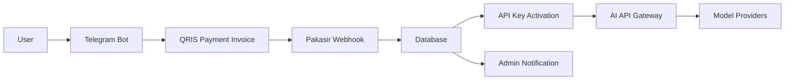

# WeizeRouter


WeizeRouter is an AI API Gateway and Web Platform that provides multi-model AI access through automated QRIS payments, Telegram-based ordering, and real-time API key activation.

WeizeRouter is built to make AI API access simple, fast, and automated.

---

## Overview

WeizeRouter allows users to order AI API access from a Telegram bot, pay automatically using QRIS, and receive an active API key instantly after payment is confirmed.

The platform combines:

- AI API Gateway
- Web Platform
- Telegram Bot Ordering
- Automated QRIS Payment
- Real-time API Key Activation
- Package-based Model Access
- Fair Use Monitoring
- Admin Notification System

---

## Live Links

Website:

https://weizerouter.web.id/

Telegram Bot:

https://t.me/WeizeRouterBot

---

## Key Features

- Multi-model AI API Gateway
- OpenAI-compatible API endpoint
- Telegram Bot package ordering
- Automated QRIS invoice generation
- Real-time webhook payment confirmation
- Automatic package activation
- Automatic API key delivery
- Package-based model access
- Fair Use monitoring system
- Admin transaction notification
- Web platform integration
- PM2 production process management
- Nginx reverse proxy deployment

---

## Packages

| Package | Duration | Description |
|---|---:|---|
| Mini Trial | 2 Hours | Quick testing package |
| Trial | 1 Day | Basic API access for testing |
| Pro | 1 Day | Daily access for regular usage |
| Ultimate | 1 Day | All Models access with Unlimited Fair Use |

Model availability may change depending on gateway stability and provider availability.

---

## Payment Flow

1. User opens the Telegram bot
2. User selects a package
3. Bot generates a QRIS invoice
4. User scans and pays using QRIS
5. Payment webhook confirms the transaction
6. Package is activated automatically
7. API key is delivered instantly by the bot

No manual payment proof is required.

---

## Architecture



---

## API Example

WeizeRouter provides an OpenAI-compatible API endpoint.

Base URL:

```txt
https://weizerouter.web.id/v1
```

Example request:

```bash
curl https://weizerouter.web.id/v1/chat/completions   -H "Authorization: Bearer wzr_live_xxx_demo"   -H "Content-Type: application/json"   -d '{
    "model": "demo-model",
    "messages": [
      {
        "role": "user",
        "content": "Hello from WeizeRouter"
      }
    ]
  }'
```

Use your own API key from the Telegram bot.

---

## Tech Stack

- Node.js
- Express.js
- SQLite
- Telegram Bot API
- QRIS Payment Integration
- Webhook Automation
- PM2
- Nginx Reverse Proxy
- OpenAI-compatible API Gateway

---

## Use Cases

- AI API access platform
- Telegram-based SaaS ordering
- QRIS automated payment system
- Multi-model AI gateway
- API key distribution automation
- Usage monitoring and fair-use control
- Small-scale AI infrastructure business

---

## Status

WeizeRouter is live with:

- automated QRIS payment
- real-time package activation
- active users
- API key delivery automation
- multi-model gateway access

---

## Security Notice

This public repository is for documentation and branding only.

It does not include:

- production source code
- real API keys
- Telegram bot tokens
- payment provider secrets
- database files
- private server credentials
- user data

---

## License

MIT License.
