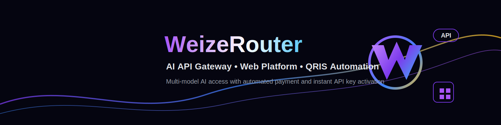

# WeizeRouter

      

**AI API Gateway, Telegram Bot Ordering, QRIS/Pakasir Payment Automation, and OpenAI-Compatible Multi-Model Access.**

WeizeRouter provides multi-model AI access through a unified OpenAI-compatible API endpoint. Users can order packages through Telegram, pay with QRIS via Pakasir, receive instant API key activation, and use supported models based on their active package.

Telegram Bot is the primary stable ordering channel. The website platform is available and being improved to stay in sync with the bot package system. The official API base URL is:

```text
https://weizerouter.web.id/v1
```

## Quick Links

| Platform | Link |
|---|---|
| Website | https://weizerouter.web.id/ |
| API Base URL | https://weizerouter.web.id/v1 |
| Telegram Bot | https://t.me/WeizeRouterBot |
| Telegram Group | https://t.me/weizerouter_indonesia |
| GitHub | https://github.com/weizerouter/weizerouter |
| LinkedIn | https://www.linkedin.com/in/weize-wang-4262b7406 |
| Threads | https://www.threads.net/@weizerouter.ai |
| Support | support@weizerouter.web.id |

## Key Features

- OpenAI-compatible `/v1` API
- Multi-model AI access
- Package-based model access
- Telegram bot ordering
- QRIS/Pakasir payment automation
- Instant API key activation after payment confirmation
- API key menu and model list menu
- Fair-use protection
- Developer-friendly examples
- Website dashboard improvements in progress

## Quick Start

**Base URL**

```text
https://weizerouter.web.id/v1
```

**Endpoint**

```text
POST /chat/completions
```

**cURL**

```bash
curl https://weizerouter.web.id/v1/chat/completions \
  -H "Authorization: Bearer YOUR_W...EY" \
  -H "Content-Type: application/json" \
  -d '{
    "model": "wz/gpt-5.5",
    "messages": [
      {"role": "user", "content": "Hello from WeizeRouter"}
    ]
  }'
```

**Python**

```python
from openai import OpenAI

client = OpenAI(
    api_key="YOUR_WEIZEROUTER_API_KEY",
    base_url="https://weizerouter.web.id/v1"
)

response = client.chat.completions.create(
    model="wz/gpt-5.5",
    messages=[{"role": "user", "content": "Hello from WeizeRouter"}]
)
print(response.choices[0].message.content)
```

**Node.js**

```javascript
import OpenAI from "openai";
const client = new OpenAI({ apiKey: "YOUR_WEIZEROUTER_API_KEY", baseURL: "https://weizerouter.web.id/v1" });
const response = await client.chat.completions.create({ model: "wz/gpt-5.5", messages: [{ role: "user", content: "Hello from WeizeRouter" }] });
console.log(response.choices[0].message.content);
```

## Package Overview

| Package | Price | Duration | Public Model Access |
|---|---:|---:|---|
| Mini Trial | Rp600 | 2 hours | `wz/grok-3` |
| Uji Coba | Rp2.000 | 1 day | `wz/grok-3` |
| Pro | Rp7.000 | 1 day | 5 selected models |
| Ultimate | Rp15.000 | 1 day | All premium public models |

Fair use applies to keep the service stable for all users. Some models may be temporarily unavailable during high traffic or provider maintenance. Model availability may change based on stability, maintenance, and service conditions.

## Model Access

### Mini Trial
- `wz/grok-3`

### Uji Coba
- `wz/grok-3`

### Pro
- `wz/grok-3`
- `wz/grok-code-fast-1`
- `wz/glm-4.7`
- `wz/qwen3-coder-next-fp8`
- `wz/qwen3.6-35b-a3b`

### Ultimate
- `wz/grok-3`
- `wz/grok-code-fast-1`
- `wz/grok-4`
- `wz/grok-4-fast-reasoning`
- `wz/gpt-5.5`
- `wz/gpt-5.5-review`
- `wz/gpt-5.4`
- `wz/gpt-5.4-review`
- `wz/gpt-5.4-mini`
- `wz/gpt-5.4-mini-review`
- `wz/deepseek-v4-flash`
- `wz/deepseek-v4-pro`
- `wz/glm-4.7`
- `wz/qwen3-coder-next-fp8`
- `wz/qwen3.5-397b-a17b`
- `wz/qwen3.6-35b-a3b`
- `wz/kimi-k2.6`
- `wz/auto`
- `wz/step-3.5-flash`
- `wz/step-3.7-flash`
- `wz/spark-x2-flash`
- `wz/step-router-v1`

## Telegram Bot Ordering Flow

1. Open [@WeizeRouterBot](https://t.me/WeizeRouterBot)
2. Select package
3. Pay via QRIS/Pakasir
4. Payment confirmation is processed automatically
5. API key is activated
6. Use the API key with `https://weizerouter.web.id/v1`

## 9Router / Custom OpenAI Compatible

| Setting | Value |
|---|---|
| Provider type | OpenAI Compatible |
| Base URL | `https://weizerouter.web.id/v1` |
| API Key | From WeizeRouterBot |
| Model example | `wz/gpt-5.5` |

## Error Format

**Access denied**

```json
{"error":{"message":"Model ini tidak tersedia untuk paket kamu.","type":"access_denied","code":"wz_model_not_allowed"}}
```

**Model unavailable**

```json
{"error":{"message":"Model sedang sibuk atau sementara tidak tersedia. Silakan coba lagi beberapa saat.","type":"model_unavailable","code":"wz_model_temporarily_unavailable"}}
```

**Fair use / rate limit**

```json
{"error":{"message":"Limit paket kamu telah tercapai. Silakan coba lagi nanti.","type":"rate_limit_exceeded","code":"wz_package_limit_reached"}}
```

## Fair Use

WeizeRouter applies fair-use protection to keep the service stable for all users. Some packages may include cooldown behavior or temporary request protection during high traffic. Internal thresholds are not publicly disclosed for security and stability reasons.

## Security Notice

- Never expose your API key publicly
- Do not commit API keys to GitHub
- Use environment variables
- Contact support for key reset
- Abuse, illegal use, and resale without permission are prohibited
- This repository does not contain production source code, API keys, database files, or secrets

## Roadmap

**Now**: Telegram bot ordering, QRIS/Pakasir payment, instant API key activation, OpenAI-compatible API, multi-model access.

**Next**: Website dashboard sync with bot packages, model health/status page, better usage analytics, API key management, package/payment visibility, and public status page.

## Founder

Created by **Wang Weize**.

WeizeRouter is built to make AI API access simpler, faster, and more accessible for Indonesian developers.

## Links

[Website](https://weizerouter.web.id/) • [Telegram Bot](https://t.me/WeizeRouterBot) • [Docs](docs/README.md) • [Support](mailto:support@weizerouter.web.id)
