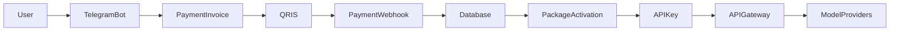

# Architecture

WeizeRouter is designed as a lightweight AI API access platform with automated payment and package activation.

## High-Level Flow

## Main Components

### Telegram Bot

The Telegram bot handles:

- user onboarding
- package selection
- QRIS invoice display
- API key delivery
- package status
- user support actions

### Payment Layer

The payment layer handles:

- QRIS invoice generation
- payment confirmation
- webhook notification
- automatic transaction update

### Database

The database stores:

- users
- packages
- transactions
- API keys
- package expiration
- usage metadata

### API Gateway

The gateway provides an OpenAI-compatible API endpoint and routes requests to available model providers.

### Admin Notification

The admin notification system helps monitor:

- new transactions
- successful payments
- revenue
- active users
- API usage

## Production Goal

The main production goal is simple:

User selects package → pays QRIS → gets API key automatically → uses AI API.
