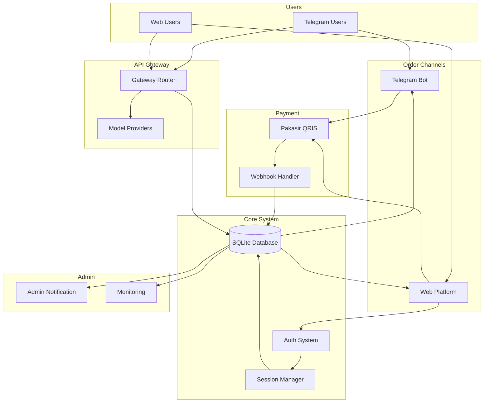
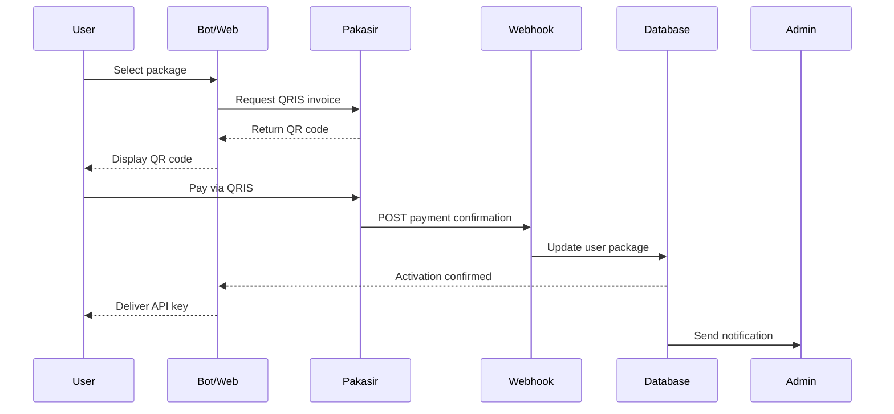
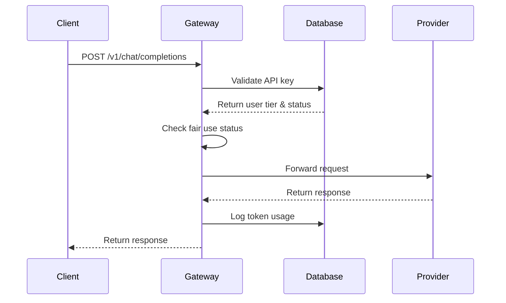

# Architecture

WeizeRouter is built on a modern, automated architecture that combines Telegram Bot, Web Platform, QRIS payment automation, and AI API Gateway into a unified system.

---

## System Overview



---

## Core Components

### 1. Order Channels

**Telegram Bot (@WeizeRouterBot)**
- Package selection and ordering
- QRIS invoice generation
- API key delivery
- Usage stats and support
- Built with: Node.js + Telegram Bot API

**Web Platform (weizerouter.web.id)**
- User dashboard
- Package management
- Usage monitoring
- Google/GitHub OAuth login
- Built with: Node.js + Express.js + EJS templates

---

### 2. Payment System

**Pakasir QRIS Integration**
- Dynamic QRIS invoice generation
- Support for all Indonesian e-wallets
- Real-time payment confirmation
- Webhook callback system

**Webhook Handler**
- Receives payment confirmation from Pakasir
- Validates webhook signature
- Verifies transaction details
- Triggers package activation
- Idempotency checks for duplicate payments

---

### 3. Core System

**SQLite Database**
- User accounts and authentication
- Package subscriptions and expiry
- API keys and access control
- Transaction logs
- Usage statistics

**Schema:**
```sql
-- Users
CREATE TABLE users (
    user_id INTEGER PRIMARY KEY,
    telegram_id TEXT UNIQUE,
    email TEXT,
    package_tier TEXT,
    expiry_time DATETIME,
    api_key TEXT UNIQUE,
    created_at DATETIME,
    updated_at DATETIME
);

-- Transactions
CREATE TABLE transactions (
    transaction_id TEXT PRIMARY KEY,
    user_id INTEGER,
    package_name TEXT,
    amount INTEGER,
    status TEXT,
    payment_method TEXT,
    created_at DATETIME,
    FOREIGN KEY (user_id) REFERENCES users(user_id)
);

-- API Usage
CREATE TABLE api_usage (
    id INTEGER PRIMARY KEY AUTOINCREMENT,
    user_id INTEGER,
    model TEXT,
    tokens_used INTEGER,
    timestamp DATETIME,
    FOREIGN KEY (user_id) REFERENCES users(user_id)
);
```

**Authentication System**
- Google OAuth 2.0
- GitHub OAuth
- Session-based authentication
- JWT tokens for API access

**Session Manager**
- Express session middleware
- Secure cookie storage
- Session persistence in database

---

### 4. AI API Gateway

**Gateway Router**
- OpenAI-compatible endpoint: `/v1/chat/completions`
- Request validation and authentication
- Model routing based on package tier
- Token usage tracking
- Fair use cooldown management

**Model Providers**
- Gemini (Google AI)
- Claude (Anthropic)
- GLM (Zhipu AI)
- Kimi (Moonshot AI)
- Additional providers as integrated

**Gateway Features:**
- Automatic failover between providers
- Request/response logging
- Error handling and retry logic
- Real-time provider health monitoring

---

### 5. Admin System

**Admin Notification**
- Real-time transaction alerts via Telegram
- Payment confirmation notifications
- Failed payment alerts
- System health warnings

**Monitoring Dashboard**
- Transaction history
- Revenue analytics
- Active user tracking
- Model usage statistics
- Gateway health metrics

---

## Data Flow

### Order to Activation Flow



### API Request Flow



---

## Infrastructure

### Deployment

**VPS Setup:**
- Ubuntu Server 22.04 LTS
- Node.js 20.x
- SQLite 3.x
- Nginx as reverse proxy
- PM2 for process management
- Let's Encrypt SSL/TLS

**Process Management (PM2):**
```
weizerouter-bot (Telegram Bot)
weizerouter-web (Web Platform)
weizerouter-gateway (API Gateway)
```

**Nginx Configuration:**
- HTTPS redirect
- Reverse proxy to Node.js apps
- Static file serving
- Rate limiting
- WebSocket support (for future features)

---

## Security Architecture

### API Key Security
- Prefix-based identification (`wzr_live_`)
- Stored hashed in database
- Rate limiting per key
- Automatic expiry on package expiration

### Payment Security
- Webhook signature validation
- HTTPS-only communication
- Transaction ID verification
- Idempotency checks
- Amount verification

### Authentication Security
- OAuth 2.0 for social login
- Secure session management
- HttpOnly cookies
- CSRF protection
- XSS prevention

---

## Scalability Considerations

**Current Architecture:**
- Single VPS deployment
- SQLite database
- PM2 clustering (multi-core)
- Nginx load balancing

**Future Scaling Options:**
1. **Horizontal Scaling:**
   - Multiple VPS instances
   - Load balancer (Nginx/HAProxy)
   - Shared PostgreSQL database

2. **Vertical Scaling:**
   - Larger VPS instance
   - More CPU cores for PM2
   - More RAM for caching

3. **Database Scaling:**
   - Migrate SQLite → PostgreSQL
   - Read replicas for analytics
   - Connection pooling

4. **Caching Layer:**
   - Redis for session storage
   - Response caching for repeated queries
   - Model provider health cache

---

## Monitoring and Observability

**Logging:**
- Application logs via PM2
- Nginx access logs
- Database query logs
- Webhook event logs

**Metrics:**
- API request count and latency
- Token usage per model
- Payment success rate
- Gateway uptime
- Fair use cooldown frequency

**Alerts:**
- Payment webhook failures
- Gateway provider outages
- Database connection issues
- High error rates

---

## Technology Stack Summary

| Layer | Technology |
|-------|------------|
| **Backend** | Node.js 20.x + Express.js |
| **Database** | SQLite 3.x |
| **Process Manager** | PM2 |
| **Web Server** | Nginx |
| **SSL/TLS** | Let's Encrypt |
| **Bot Framework** | Telegram Bot API |
| **Payment Gateway** | Pakasir QRIS |
| **Authentication** | OAuth 2.0 (Google, GitHub) |
| **Template Engine** | EJS |
| **API Standard** | OpenAI-compatible |

---

## Support

Technical questions?
- Telegram Bot: [@WeizeRouterBot](https://t.me/WeizeRouterBot)
- LinkedIn: [Wang Weize](https://www.linkedin.com/in/weize-wang-4262b7406)

---

**Last Updated:** July 2026
